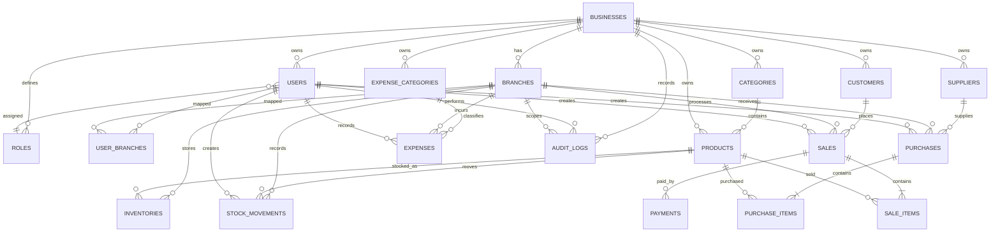

# DukaFlow AI MySQL ERD and Data Dictionary

**Status:** Draft for review  
**Issue:** #7 — Design MySQL ERD and data dictionary  
**Author:** JobMunyoki  
**Reviewer:** PURITY-CODES-dev  

## 1. Purpose

This document defines the initial MySQL data model for the DukaFlow AI MVP. It supports multiple businesses and branches, user access control, products, inventory, suppliers, purchases, customers, sales, payments, expenses, and audit logs.

## 2. Design Principles

1. All tenant-owned data is linked to `business_id`.
2. Branch-scoped operational data is linked to `branch_id`.
3. Monetary values use `DECIMAL(15,2)`.
4. Product quantities use `DECIMAL(15,3)`.
5. Completed transactions are preserved rather than physically deleted.
6. Every stock change creates an immutable stock-movement record.
7. Foreign keys, unique constraints, checks, and transactions protect integrity.
8. Important records include `created_at` and `updated_at`.

## 3. Entity Relationship Diagram



## 4. Data Dictionary

### 4.1 `businesses`

| Column | Type | Null | Key | Description |
|---|---|---:|---|---|
| `id` | BIGINT UNSIGNED | No | PK | Business ID |
| `name` | VARCHAR(150) | No |  | Business name |
| `business_code` | VARCHAR(50) | No | UQ | Unique reference |
| `phone` | VARCHAR(30) | Yes |  | Phone |
| `email` | VARCHAR(150) | Yes |  | Email |
| `tax_pin` | VARCHAR(50) | Yes |  | Tax PIN |
| `currency_code` | CHAR(3) | No |  | Default `KES` |
| `is_active` | BOOLEAN | No |  | Active status |
| `created_at` | DATETIME | No |  | Created time |
| `updated_at` | DATETIME | No |  | Updated time |

### 4.2 `branches`

| Column | Type | Null | Key | Description |
|---|---|---:|---|---|
| `id` | BIGINT UNSIGNED | No | PK | Branch ID |
| `business_id` | BIGINT UNSIGNED | No | FK | Owning business |
| `branch_code` | VARCHAR(50) | No | UQ* | Unique within business |
| `name` | VARCHAR(150) | No |  | Branch name |
| `phone` | VARCHAR(30) | Yes |  | Phone |
| `email` | VARCHAR(150) | Yes |  | Email |
| `address_line` | VARCHAR(255) | Yes |  | Address |
| `is_active` | BOOLEAN | No |  | Active status |
| `created_at` | DATETIME | No |  | Created time |
| `updated_at` | DATETIME | No |  | Updated time |

Constraint: unique `(business_id, branch_code)`.

### 4.3 `roles`

| Column | Type | Null | Key | Description |
|---|---|---:|---|---|
| `id` | BIGINT UNSIGNED | No | PK | Role ID |
| `business_id` | BIGINT UNSIGNED | No | FK | Owning business |
| `name` | VARCHAR(80) | No | UQ* | Role name |
| `description` | VARCHAR(255) | Yes |  | Description |
| `is_system_role` | BOOLEAN | No |  | Built-in flag |
| `is_active` | BOOLEAN | No |  | Active status |
| `created_at` | DATETIME | No |  | Created time |
| `updated_at` | DATETIME | No |  | Updated time |

Initial roles: Business Owner, Administrator, Branch Manager, Cashier, Storekeeper, Accountant.

### 4.4 `users`

| Column | Type | Null | Key | Description |
|---|---|---:|---|---|
| `id` | BIGINT UNSIGNED | No | PK | User ID |
| `business_id` | BIGINT UNSIGNED | No | FK | Business |
| `role_id` | BIGINT UNSIGNED | No | FK | Role |
| `full_name` | VARCHAR(150) | No |  | Full name |
| `email` | VARCHAR(150) | No | UQ | Login email |
| `username` | VARCHAR(80) | Yes | UQ | Optional username |
| `password_hash` | VARCHAR(255) | No |  | Password hash |
| `phone` | VARCHAR(30) | Yes |  | Phone |
| `is_active` | BOOLEAN | No |  | Account status |
| `last_login_at` | DATETIME | Yes |  | Last login |
| `created_at` | DATETIME | No |  | Created time |
| `updated_at` | DATETIME | No |  | Updated time |

### 4.5 `user_branches`

| Column | Type | Null | Key | Description |
|---|---|---:|---|---|
| `user_id` | BIGINT UNSIGNED | No | PK/FK | User |
| `branch_id` | BIGINT UNSIGNED | No | PK/FK | Branch |
| `assigned_at` | DATETIME | No |  | Assignment time |

Composite primary key: `(user_id, branch_id)`.

### 4.6 `categories`

| Column | Type | Null | Key | Description |
|---|---|---:|---|---|
| `id` | BIGINT UNSIGNED | No | PK | Category ID |
| `business_id` | BIGINT UNSIGNED | No | FK | Business |
| `name` | VARCHAR(120) | No | UQ* | Category name |
| `description` | VARCHAR(255) | Yes |  | Description |
| `is_active` | BOOLEAN | No |  | Status |
| `created_at` | DATETIME | No |  | Created time |
| `updated_at` | DATETIME | No |  | Updated time |

Constraint: unique `(business_id, name)`.

### 4.7 `products`

| Column | Type | Null | Key | Description |
|---|---|---:|---|---|
| `id` | BIGINT UNSIGNED | No | PK | Product ID |
| `business_id` | BIGINT UNSIGNED | No | FK | Business |
| `category_id` | BIGINT UNSIGNED | Yes | FK | Category |
| `sku` | VARCHAR(80) | No | UQ* | SKU |
| `name` | VARCHAR(180) | No |  | Product name |
| `description` | TEXT | Yes |  | Description |
| `unit_of_measure` | VARCHAR(40) | No |  | Piece, kg, bag, etc. |
| `cost_price` | DECIMAL(15,2) | No |  | Cost price |
| `selling_price` | DECIMAL(15,2) | No |  | Selling price |
| `reorder_level` | DECIMAL(15,3) | No |  | Low-stock threshold |
| `is_active` | BOOLEAN | No |  | Status |
| `created_at` | DATETIME | No |  | Created time |
| `updated_at` | DATETIME | No |  | Updated time |

Constraint: unique `(business_id, sku)`.

### 4.8 `inventories`

| Column | Type | Null | Key | Description |
|---|---|---:|---|---|
| `id` | BIGINT UNSIGNED | No | PK | Inventory ID |
| `business_id` | BIGINT UNSIGNED | No | FK | Business |
| `branch_id` | BIGINT UNSIGNED | No | FK | Branch |
| `product_id` | BIGINT UNSIGNED | No | FK | Product |
| `quantity_on_hand` | DECIMAL(15,3) | No |  | Current quantity |
| `reserved_quantity` | DECIMAL(15,3) | No |  | Reserved quantity |
| `updated_at` | DATETIME | No |  | Updated time |

Constraint: unique `(branch_id, product_id)`. Quantities must be non-negative.

### 4.9 `stock_movements`

| Column | Type | Null | Key | Description |
|---|---|---:|---|---|
| `id` | BIGINT UNSIGNED | No | PK | Movement ID |
| `business_id` | BIGINT UNSIGNED | No | FK | Business |
| `branch_id` | BIGINT UNSIGNED | No | FK | Branch |
| `product_id` | BIGINT UNSIGNED | No | FK | Product |
| `created_by` | BIGINT UNSIGNED | No | FK | Acting user |
| `movement_type` | VARCHAR(40) | No |  | Movement type |
| `quantity_change` | DECIMAL(15,3) | No |  | Signed change |
| `quantity_before` | DECIMAL(15,3) | No |  | Before balance |
| `quantity_after` | DECIMAL(15,3) | No |  | After balance |
| `reference_type` | VARCHAR(50) | Yes |  | Source type |
| `reference_id` | BIGINT UNSIGNED | Yes |  | Source ID |
| `reason` | VARCHAR(255) | Yes |  | Reason |
| `created_at` | DATETIME | No |  | Created time |

Types: PURCHASE, SALE, RETURN_IN, RETURN_OUT, ADJUSTMENT_IN, ADJUSTMENT_OUT, TRANSFER_IN, TRANSFER_OUT.

### 4.10 `suppliers`

| Column | Type | Null | Key | Description |
|---|---|---:|---|---|
| `id` | BIGINT UNSIGNED | No | PK | Supplier ID |
| `business_id` | BIGINT UNSIGNED | No | FK | Business |
| `supplier_code` | VARCHAR(60) | Yes | UQ* | Supplier code |
| `name` | VARCHAR(180) | No |  | Supplier name |
| `phone` | VARCHAR(30) | Yes |  | Phone |
| `email` | VARCHAR(150) | Yes |  | Email |
| `tax_pin` | VARCHAR(50) | Yes |  | Tax PIN |
| `address_line` | VARCHAR(255) | Yes |  | Address |
| `is_active` | BOOLEAN | No |  | Status |
| `created_at` | DATETIME | No |  | Created time |
| `updated_at` | DATETIME | No |  | Updated time |

### 4.11 `purchases`

| Column | Type | Null | Key | Description |
|---|---|---:|---|---|
| `id` | BIGINT UNSIGNED | No | PK | Purchase ID |
| `business_id` | BIGINT UNSIGNED | No | FK | Business |
| `branch_id` | BIGINT UNSIGNED | No | FK | Receiving branch |
| `supplier_id` | BIGINT UNSIGNED | No | FK | Supplier |
| `created_by` | BIGINT UNSIGNED | No | FK | User |
| `purchase_number` | VARCHAR(80) | No | UQ* | Purchase number |
| `supplier_invoice_number` | VARCHAR(100) | Yes |  | Supplier invoice |
| `purchase_date` | DATETIME | No |  | Purchase date |
| `status` | VARCHAR(30) | No |  | DRAFT, COMPLETED, CANCELLED |
| `subtotal` | DECIMAL(15,2) | No |  | Subtotal |
| `discount_total` | DECIMAL(15,2) | No |  | Discount |
| `tax_total` | DECIMAL(15,2) | No |  | Tax |
| `total_amount` | DECIMAL(15,2) | No |  | Total |
| `completed_at` | DATETIME | Yes |  | Completion time |
| `cancelled_at` | DATETIME | Yes |  | Cancellation time |
| `created_at` | DATETIME | No |  | Created time |
| `updated_at` | DATETIME | No |  | Updated time |

Constraint: unique `(business_id, purchase_number)`.

### 4.12 `purchase_items`

| Column | Type | Null | Key | Description |
|---|---|---:|---|---|
| `id` | BIGINT UNSIGNED | No | PK | Line ID |
| `purchase_id` | BIGINT UNSIGNED | No | FK | Purchase |
| `product_id` | BIGINT UNSIGNED | No | FK | Product |
| `quantity` | DECIMAL(15,3) | No |  | Quantity |
| `unit_cost` | DECIMAL(15,2) | No |  | Unit cost |
| `discount_amount` | DECIMAL(15,2) | No |  | Discount |
| `tax_amount` | DECIMAL(15,2) | No |  | Tax |
| `line_total` | DECIMAL(15,2) | No |  | Line total |

Quantity must be greater than zero.

### 4.13 `customers`

| Column | Type | Null | Key | Description |
|---|---|---:|---|---|
| `id` | BIGINT UNSIGNED | No | PK | Customer ID |
| `business_id` | BIGINT UNSIGNED | No | FK | Business |
| `customer_code` | VARCHAR(60) | Yes | UQ* | Customer code |
| `name` | VARCHAR(180) | No |  | Customer name |
| `phone` | VARCHAR(30) | Yes |  | Phone |
| `email` | VARCHAR(150) | Yes |  | Email |
| `is_walk_in` | BOOLEAN | No |  | Walk-in flag |
| `is_active` | BOOLEAN | No |  | Status |
| `created_at` | DATETIME | No |  | Created time |
| `updated_at` | DATETIME | No |  | Updated time |

### 4.14 `sales`

| Column | Type | Null | Key | Description |
|---|---|---:|---|---|
| `id` | BIGINT UNSIGNED | No | PK | Sale ID |
| `business_id` | BIGINT UNSIGNED | No | FK | Business |
| `branch_id` | BIGINT UNSIGNED | No | FK | Selling branch |
| `customer_id` | BIGINT UNSIGNED | Yes | FK | Customer |
| `created_by` | BIGINT UNSIGNED | No | FK | Cashier/user |
| `sale_number` | VARCHAR(80) | No | UQ* | Sale number |
| `receipt_number` | VARCHAR(80) | Yes | UQ* | Receipt number |
| `sale_date` | DATETIME | No |  | Sale date |
| `status` | VARCHAR(30) | No |  | DRAFT, COMPLETED, CANCELLED, RETURNED |
| `subtotal` | DECIMAL(15,2) | No |  | Subtotal |
| `discount_total` | DECIMAL(15,2) | No |  | Discount |
| `tax_total` | DECIMAL(15,2) | No |  | Tax |
| `total_amount` | DECIMAL(15,2) | No |  | Total |
| `completed_at` | DATETIME | Yes |  | Completion time |
| `cancelled_at` | DATETIME | Yes |  | Cancellation time |
| `created_at` | DATETIME | No |  | Created time |
| `updated_at` | DATETIME | No |  | Updated time |

Constraints: unique `(business_id, sale_number)` and `(business_id, receipt_number)` when present.

### 4.15 `sale_items`

| Column | Type | Null | Key | Description |
|---|---|---:|---|---|
| `id` | BIGINT UNSIGNED | No | PK | Line ID |
| `sale_id` | BIGINT UNSIGNED | No | FK | Sale |
| `product_id` | BIGINT UNSIGNED | No | FK | Product |
| `quantity` | DECIMAL(15,3) | No |  | Quantity |
| `unit_price` | DECIMAL(15,2) | No |  | Unit price |
| `discount_amount` | DECIMAL(15,2) | No |  | Discount |
| `tax_amount` | DECIMAL(15,2) | No |  | Tax |
| `line_total` | DECIMAL(15,2) | No |  | Line total |

Quantity must be greater than zero.

### 4.16 `payments`

| Column | Type | Null | Key | Description |
|---|---|---:|---|---|
| `id` | BIGINT UNSIGNED | No | PK | Payment ID |
| `business_id` | BIGINT UNSIGNED | No | FK | Business |
| `sale_id` | BIGINT UNSIGNED | Yes | FK | Related sale |
| `payment_method` | VARCHAR(40) | No |  | CASH, CARD, BANK_TRANSFER, MPESA |
| `amount` | DECIMAL(15,2) | No |  | Amount |
| `status` | VARCHAR(30) | No |  | PENDING, COMPLETED, FAILED, REFUNDED |
| `external_reference` | VARCHAR(120) | Yes |  | Provider reference |
| `provider_request_id` | VARCHAR(120) | Yes | UQ | Request ID |
| `paid_at` | DATETIME | Yes |  | Paid time |
| `created_at` | DATETIME | No |  | Created time |
| `updated_at` | DATETIME | No |  | Updated time |

### 4.17 `expense_categories`

| Column | Type | Null | Key | Description |
|---|---|---:|---|---|
| `id` | BIGINT UNSIGNED | No | PK | Category ID |
| `business_id` | BIGINT UNSIGNED | No | FK | Business |
| `name` | VARCHAR(120) | No | UQ* | Category name |
| `description` | VARCHAR(255) | Yes |  | Description |
| `is_active` | BOOLEAN | No |  | Status |
| `created_at` | DATETIME | No |  | Created time |
| `updated_at` | DATETIME | No |  | Updated time |

### 4.18 `expenses`

| Column | Type | Null | Key | Description |
|---|---|---:|---|---|
| `id` | BIGINT UNSIGNED | No | PK | Expense ID |
| `business_id` | BIGINT UNSIGNED | No | FK | Business |
| `branch_id` | BIGINT UNSIGNED | No | FK | Branch |
| `expense_category_id` | BIGINT UNSIGNED | No | FK | Category |
| `created_by` | BIGINT UNSIGNED | No | FK | User |
| `expense_number` | VARCHAR(80) | No | UQ* | Expense reference |
| `expense_date` | DATETIME | No |  | Expense date |
| `amount` | DECIMAL(15,2) | No |  | Amount |
| `payment_method` | VARCHAR(40) | No |  | Payment method |
| `description` | VARCHAR(500) | Yes |  | Notes |
| `status` | VARCHAR(30) | No |  | DRAFT, COMPLETED, CANCELLED |
| `created_at` | DATETIME | No |  | Created time |
| `updated_at` | DATETIME | No |  | Updated time |

### 4.19 `audit_logs`

| Column | Type | Null | Key | Description |
|---|---|---:|---|---|
| `id` | BIGINT UNSIGNED | No | PK | Audit ID |
| `business_id` | BIGINT UNSIGNED | No | FK | Business |
| `branch_id` | BIGINT UNSIGNED | Yes | FK | Branch |
| `user_id` | BIGINT UNSIGNED | Yes | FK | Acting user |
| `action` | VARCHAR(80) | No |  | Action |
| `entity_type` | VARCHAR(80) | No |  | Entity type |
| `entity_id` | BIGINT UNSIGNED | Yes |  | Entity ID |
| `summary` | VARCHAR(500) | Yes |  | Summary |
| `old_values_json` | JSON | Yes |  | Previous values |
| `new_values_json` | JSON | Yes |  | New values |
| `ip_address` | VARCHAR(45) | Yes |  | IP address |
| `created_at` | DATETIME | No |  | Audit time |

Audit records must not be edited or physically deleted.

## 5. Recommended Indexes

```sql
CREATE INDEX idx_users_business_role
    ON users (business_id, role_id);

CREATE INDEX idx_products_business_name
    ON products (business_id, name);

CREATE INDEX idx_inventory_branch_product
    ON inventories (branch_id, product_id);

CREATE INDEX idx_stock_movement_branch_product_date
    ON stock_movements (branch_id, product_id, created_at);

CREATE INDEX idx_purchases_business_branch_date
    ON purchases (business_id, branch_id, purchase_date);

CREATE INDEX idx_sales_business_branch_date
    ON sales (business_id, branch_id, sale_date);

CREATE INDEX idx_expenses_business_branch_date
    ON expenses (business_id, branch_id, expense_date);

CREATE INDEX idx_audit_business_date
    ON audit_logs (business_id, created_at);
```

## 6. Transaction Rules

### Purchase completion

1. Confirm the purchase is not already completed.
2. Mark it completed.
3. Increase branch inventory.
4. create stock-movement records.
5. Create an audit record.
6. Commit all steps together.

### Sale completion

1. Confirm the sale is not already completed.
2. Validate available stock.
3. Create or complete the sale.
4. Record payment.
5. Reduce inventory.
6. Create stock movements and an audit record.
7. Commit all steps together.

### Stock transfer

1. Validate source and destination branches.
2. Validate available source stock.
3. Reduce source inventory.
4. Increase destination inventory.
5. Create `TRANSFER_OUT` and `TRANSFER_IN` movements.
6. Commit both sides together.

## 7. Data Isolation Rules

The backend must enforce:

```text
record.business_id = authenticated_user.business_id
```

For branch-restricted users:

```text
record.branch_id IN authenticated_user.assigned_branch_ids
```

The backend must never trust a client-supplied `business_id` without validating it.

## 8. Deletion Strategy

Use soft deactivation for businesses, branches, roles, users, categories, products, suppliers, customers, and expense categories.

Preserve completed purchases, sales, payments, stock movements, expenses, and audit logs.

## 9. Naming Conventions

- Tables: lowercase plural snake case
- Columns: lowercase snake case
- Primary keys: `id`
- Foreign keys: `<entity>_id`
- Booleans: `is_<state>`
- Event timestamps: `<event>_at`
- Money: `DECIMAL(15,2)`
- Quantity: `DECIMAL(15,3)`

## 10. Migration Plan

```text
V1__create_business_and_access_tables.sql
V2__create_product_and_inventory_tables.sql
V3__create_supplier_and_purchase_tables.sql
V4__create_customer_sale_and_payment_tables.sql
V5__create_expense_and_audit_tables.sql
V6__create_indexes_and_constraints.sql
V7__seed_initial_roles.sql
```

Use Flyway or Liquibase. Never edit a migration that has already been applied to a shared or production database.

## 11. Open Design Decisions

- Whether permissions require dedicated `permissions` and `role_permissions` tables
- Whether product prices can vary by branch
- Whether partial purchase and sales payments are supported
- Whether returns require dedicated return tables
- Whether transfers require dedicated transfer header and item tables
- Whether configurable tax tables are required
- How much old/new data audit logs should retain

## 12. Issue #7 Acceptance Checklist

- [x] Entities and relationships are identified
- [x] Primary keys are defined
- [x] Foreign keys are defined
- [x] Required and optional fields are identified
- [x] Business and branch data isolation is supported
- [x] Audit fields are included
- [x] ERD is created
- [x] Data dictionary is created
- [ ] Design is reviewed by PURITY-CODES-dev
- [x] File is prepared for `docs/architecture`

## 13. Approval

| Contributor | Responsibility | Status |
|---|---|---|
| JobMunyoki | Database design author | Completed |
| PURITY-CODES-dev | Database design reviewer | Pending |

The database baseline is approved after review comments are resolved and the pull request is merged into `develop`.
