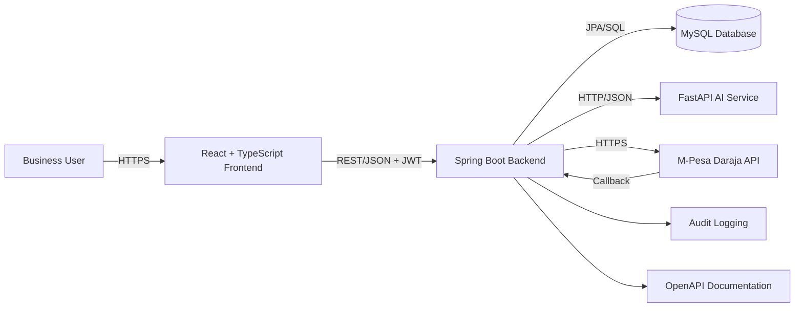
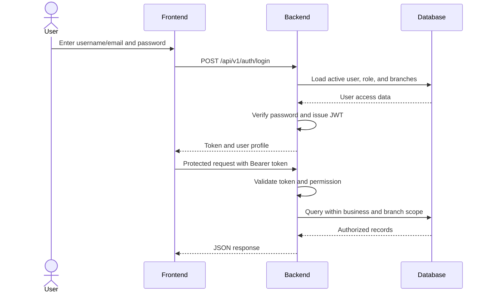
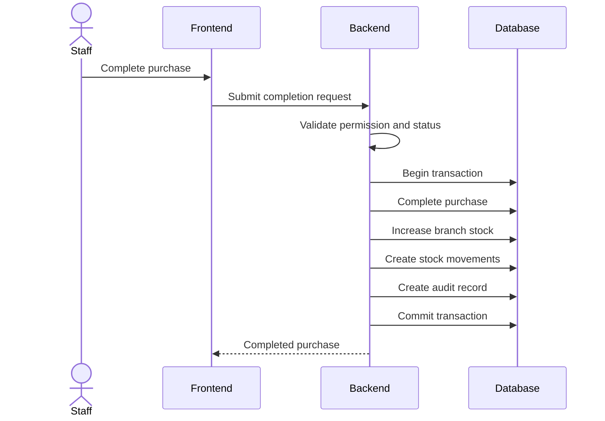
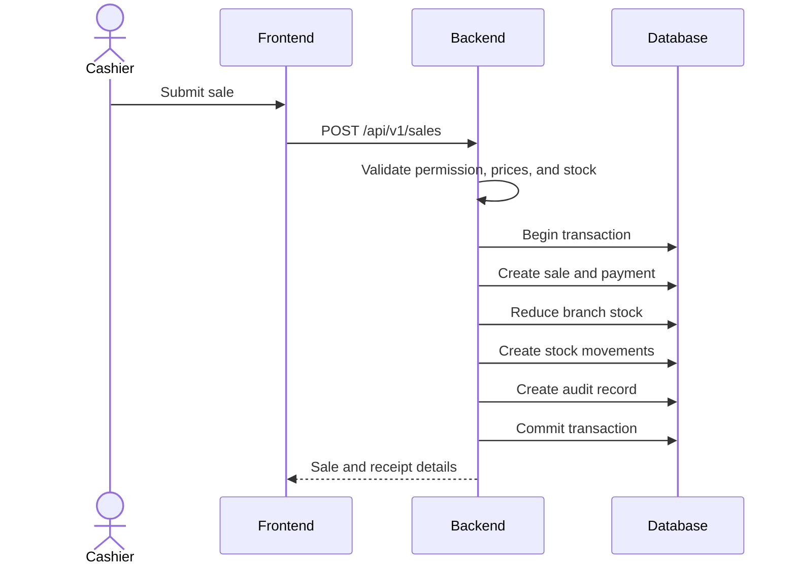
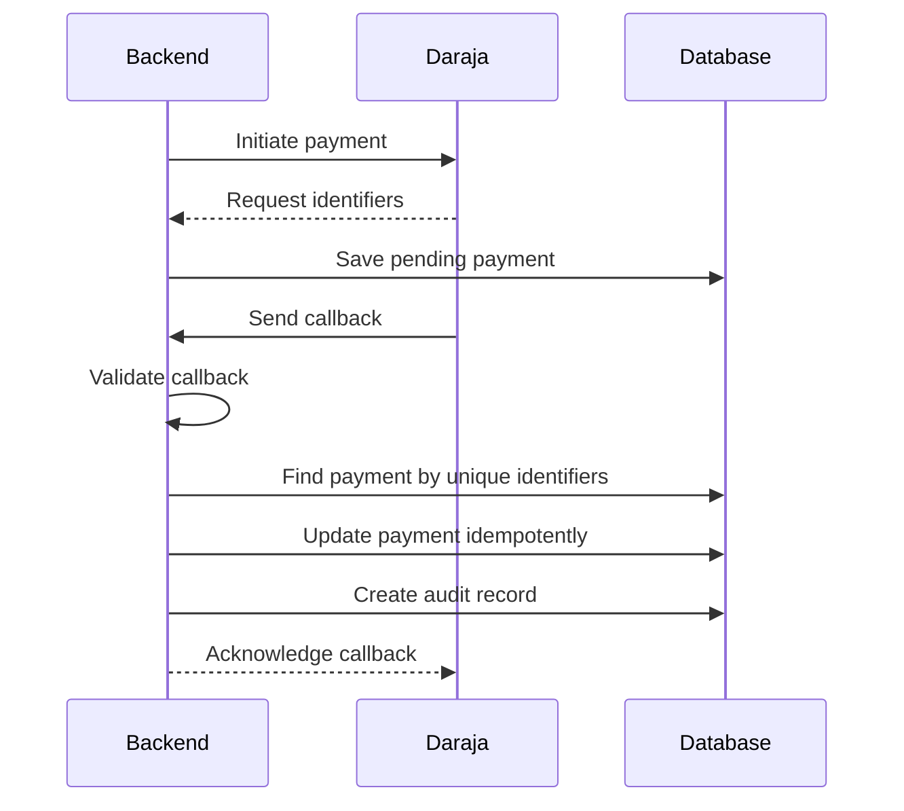
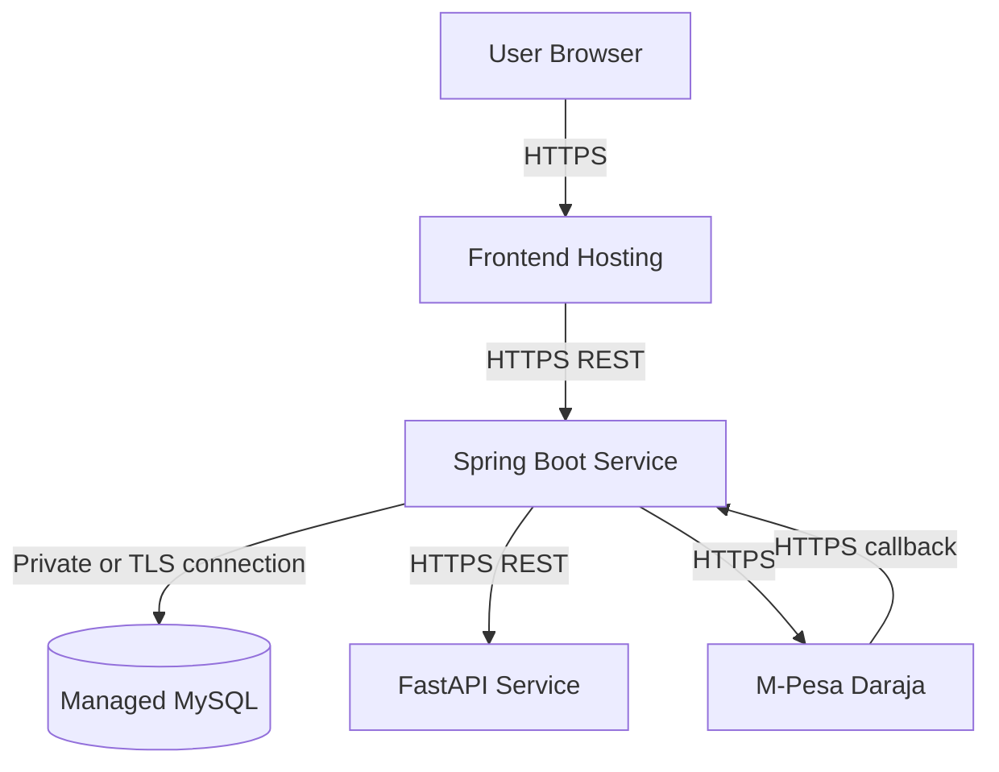

# DukaFlow AI System Architecture

**Status:** Draft for review  
**Issue:** #6 — Create system architecture design  
**Author:** JobMunyoki  
**Reviewer:** PURITY-CODES-dev  

## 1. Purpose

This document defines the MVP architecture for DukaFlow AI, a multi-branch retail ERP for Kenyan SMEs. It separates the user interface, core business logic, database, AI capabilities, and external payment integration so that each component can be developed and tested independently.

## 2. Architecture Goals

- Support multiple businesses and branches securely.
- Enforce role-based and branch-based permissions.
- Preserve transactional integrity for purchases, sales, stock, and payments.
- Keep the frontend independent from backend implementation details.
- Allow AI features to evolve separately from the ERP core.
- Integrate M-Pesa through a controlled backend layer.
- Support Docker-based local development.
- Support independent deployment of major components.
- Enable collaboration through clear module boundaries.

## 3. High-Level Architecture



## 4. Component Responsibilities

### 4.1 React and TypeScript Frontend

Responsibilities:

- Provide login, dashboard, products, inventory, suppliers, purchases, customers, sales, expenses, reports, users, roles, and settings screens.
- Call the Spring Boot API using HTTPS and JSON.
- Attach JWT bearer tokens to protected requests.
- Apply client-side validation for usability.
- Display loading, success, warning, and error states.
- Hide or disable actions that the user is not permitted to perform.
- Support desktop, tablet, and mobile browser sizes.
- Never connect directly to MySQL.
- Never act as the only authorization layer.

Proposed tools:

- React
- TypeScript
- Vite
- Material UI
- React Router
- Axios or Fetch
- React Query
- Vitest and React Testing Library

### 4.2 Spring Boot Backend

The backend is the authoritative business layer.

Responsibilities:

- Authenticate users and issue JWT tokens.
- Enforce role-based and branch-based access.
- Validate business rules.
- Manage businesses, branches, users, roles, products, inventory, suppliers, purchases, customers, sales, expenses, payments, reports, and audit logs.
- Coordinate database transactions.
- Expose REST endpoints under `/api/v1`.
- Integrate with FastAPI and M-Pesa Daraja.
- Receive and validate payment callbacks.
- Return consistent API responses and errors.
- Publish OpenAPI documentation.
- Expose health checks.

Proposed tools:

- Java
- Spring Boot
- Spring Web
- Spring Security
- Spring Data JPA
- Jakarta Bean Validation
- MySQL Connector/J
- Flyway or Liquibase
- Spring Boot Actuator
- OpenAPI/Swagger
- JUnit and Mockito

### 4.3 MySQL Database

Responsibilities:

- Store business and branch data.
- Store users, roles, and branch assignments.
- Store products, categories, inventory, and stock movements.
- Store suppliers and purchases.
- Store customers and sales.
- Store expenses and payments.
- Store audit records.
- Enforce primary keys, foreign keys, unique constraints, and required fields.
- Support transactional integrity.

Data isolation rules:

- Every business-owned record must include or be linked to `business_id`.
- Every branch-scoped record must include or be linked to `branch_id`.
- Backend queries must apply the authenticated user's business and branch scope.

### 4.4 FastAPI AI Service

The AI service is independent from the ERP core.

Future responsibilities:

- Demand forecasting
- Sales prediction
- Reorder recommendations
- Slow-moving-stock detection
- Anomaly detection

Communication rules:

- The frontend does not call FastAPI directly.
- Spring Boot validates access before sending data to FastAPI.
- Communication uses HTTP and JSON.
- The AI service receives only the minimum required data.
- Secrets and personal data are not passed unnecessarily.

Proposed tools:

- Python
- FastAPI
- Pydantic
- Pandas
- scikit-learn
- Uvicorn
- Pytest

### 4.5 M-Pesa Daraja Integration

The Spring Boot backend owns M-Pesa integration.

Responsibilities:

- Initiate supported payment requests.
- Store request identifiers.
- Receive callbacks.
- Validate callback structure.
- Update payment status idempotently.
- Prevent duplicate callback processing.
- Preserve reconciliation and audit data.

MVP approach:

- Manual M-Pesa reference can be supported first.
- Automated Daraja sandbox processing is introduced after core sales are stable.

Security:

- Credentials remain in environment variables.
- Callback URLs use HTTPS in deployed environments.
- Secrets are never committed to Git.
- Callback data is visible only to authorized users.

## 5. Backend Module Structure

```text
backend/
└── src/main/java/.../dukaflow/
    ├── auth/
    ├── business/
    ├── branch/
    ├── user/
    ├── role/
    ├── product/
    ├── category/
    ├── inventory/
    ├── supplier/
    ├── purchase/
    ├── customer/
    ├── sale/
    ├── expense/
    ├── payment/
    ├── report/
    ├── audit/
    ├── integration/
    │   ├── ai/
    │   └── mpesa/
    └── common/
        ├── config/
        ├── exception/
        ├── response/
        └── security/
```

Each module may contain:

```text
controller/
dto/
entity/
repository/
service/
mapper/
validation/
```

Controllers must not contain core business logic.

## 6. Frontend Structure

```text
frontend/
└── src/
    ├── app/
    ├── api/
    ├── assets/
    ├── components/
    ├── features/
    │   ├── auth/
    │   ├── dashboard/
    │   ├── products/
    │   ├── inventory/
    │   ├── suppliers/
    │   ├── purchases/
    │   ├── customers/
    │   ├── sales/
    │   ├── expenses/
    │   ├── reports/
    │   └── users/
    ├── hooks/
    ├── layouts/
    ├── routes/
    ├── theme/
    ├── types/
    └── utils/
```

## 7. Authentication and Authorization Flow



Rules:

1. Passwords are stored as secure hashes.
2. The backend validates every protected request.
3. Disabled users are denied access.
4. Users cannot access another business's data.
5. Branch-restricted users only access assigned branches.
6. Frontend route protection does not replace backend authorization.

## 8. Core Transaction Flows

### 8.1 Purchase Completion



A failure must roll back the entire transaction.

### 8.2 Sale Completion



The same sale must never reduce stock twice.

### 8.3 M-Pesa Callback



## 9. API Conventions

- Base path: `/api/v1`
- Format: JSON
- Authentication: `Authorization: Bearer <token>`
- Dates and times: ISO 8601
- Money: decimal values with fixed precision
- Pagination: page, size, sort, and filters
- Errors: consistent JSON structure
- External integrations: HTTPS
- AI requests: backend-to-service only

Example error:

```json
{
  "timestamp": "2026-08-03T12:00:00Z",
  "status": 400,
  "code": "VALIDATION_ERROR",
  "message": "The request contains invalid values.",
  "fieldErrors": {
    "quantity": "Quantity must be greater than zero."
  },
  "path": "/api/v1/sales"
}
```

## 10. Security Architecture

Frontend controls:

- Protected routes
- Role-aware menus
- Safe error display
- No secrets in source code

Backend controls:

- JWT validation
- Role and permission checks
- Business and branch scoping
- Input validation
- Password hashing
- Transactional operations
- Audit logging
- Safe exception handling

Database controls:

- Foreign keys and unique constraints
- Least-privilege credentials
- Regular backups
- No public direct access

Integration controls:

- Environment-variable secrets
- HTTPS
- Callback validation
- Idempotency
- Minimum necessary data sharing

## 11. Deployment Architecture



Deployment assumptions:

1. Frontend and backend may be hosted separately.
2. Production MySQL should use a managed database service.
3. Production traffic uses HTTPS.
4. Environment variables store database credentials, JWT secrets, and API keys.
5. Flyway or Liquibase manages schema changes.
6. Deployable services expose health checks.
7. Logs are accessible to authorized maintainers.
8. Database backups are configured through the hosting strategy.
9. CORS allows only approved frontend origins.
10. FastAPI can be added without redesigning the core backend.

Local development:

- Docker Compose manages MySQL.
- Spring Boot connects through documented environment variables.
- FastAPI can be added to Docker Compose when AI development starts.
- The React application may run through Vite during development.

## 12. Observability and Error Handling

The MVP should include:

- Structured backend logs
- Clear API error codes
- Spring Boot health endpoint
- Audit logs for important actions
- No secrets or sensitive data in logs
- Deployment-platform log access
- Future metrics for latency, error rate, and service health

## 13. Collaboration Model

Both contributors will use:

1. GitHub issues
2. Branches based on `develop`
3. Focused commits
4. Pull requests targeting `develop`
5. Peer review
6. Merge after approval
7. Deletion of completed branches
8. Regular synchronization with `develop`

Example branches:

```text
docs/6-system-architecture
feature/12-spring-boot-setup
feature/13-react-setup
chore/14-mysql-docker
```

## 14. Architectural Decisions

### ADR-001: Spring Boot is the system of record

The frontend and AI service do not directly modify MySQL.

### ADR-002: MySQL stores transactional data

Sales, purchases, stock, and payments require relational integrity and transactions.

### ADR-003: FastAPI remains independent

AI dependencies and model lifecycles remain separate from the Spring Boot core.

### ADR-004: Spring Boot owns M-Pesa integration

This protects credentials and centralizes payment rules.

### ADR-005: Modular monolith first

The backend begins as a modular monolith to avoid premature microservice complexity.

### ADR-006: REST and JSON are the initial integration standard

React, Spring Boot, FastAPI, and external integrations communicate through documented HTTP APIs.

## 15. Risks and Mitigations

### Cross-business data exposure

**Mitigation:** Enforce business scope in authentication, services, repository queries, and automated tests.

### Incorrect stock balances

**Mitigation:** Use database transactions, stock-movement records, validation, and tests.

### Duplicate payment callbacks

**Mitigation:** Use unique identifiers and idempotent processing.

### Frontend/backend contract mismatch

**Mitigation:** Approve the API contract before detailed feature implementation.

### Premature microservice complexity

**Mitigation:** Keep the core backend modular but deploy it initially as one application.

### AI delaying the ERP core

**Mitigation:** Keep AI behind a separate service interface and implement it after clean historical data exists.

## 16. Acceptance Checklist

- [x] React frontend is represented
- [x] Spring Boot backend is represented
- [x] MySQL database is represented
- [x] FastAPI AI service is represented
- [x] M-Pesa Daraja integration point is represented
- [x] Authentication and authorization flow is documented
- [x] Communication between services is documented
- [x] Deployment assumptions are documented
- [x] Architecture diagrams are included
- [ ] Architecture is reviewed by PURITY-CODES-dev

## 17. Approval

| Contributor | Responsibility | Status |
|---|---|---|
| JobMunyoki | Architecture author | Completed |
| PURITY-CODES-dev | Architecture reviewer | Pending |

The architecture baseline is approved after review comments are resolved and the pull request is merged into `develop`.
